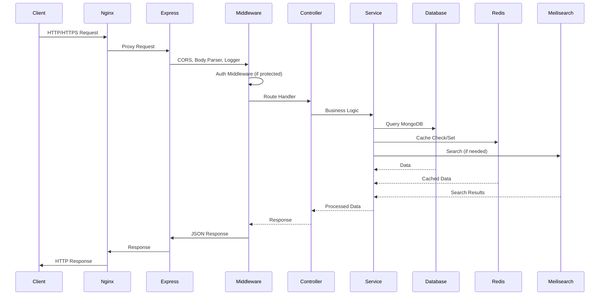
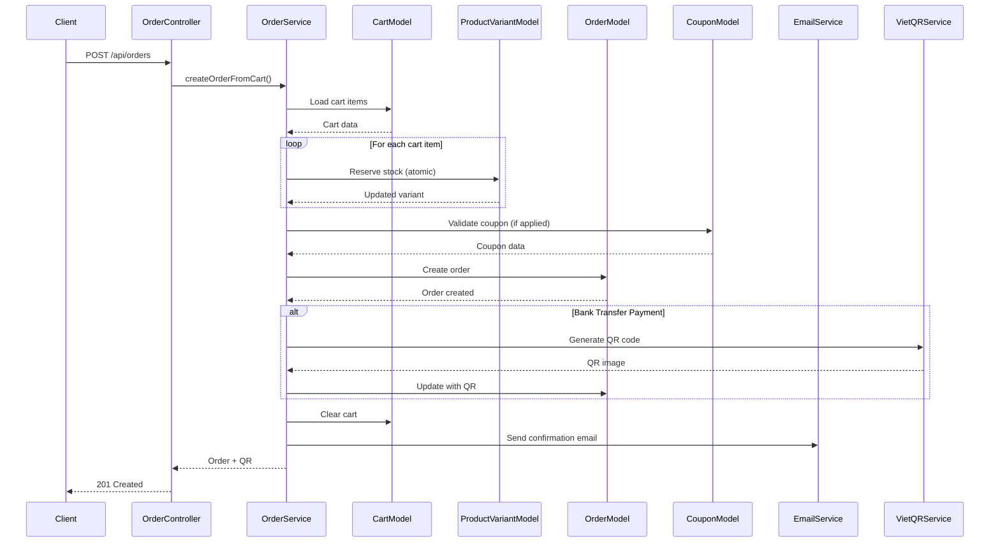
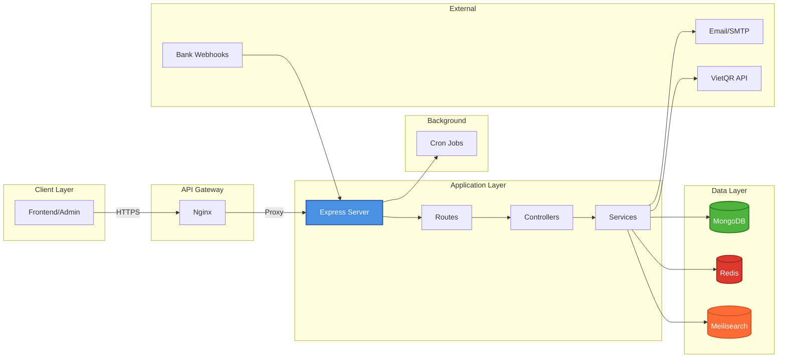

# Backend Architecture

## System Architecture Diagram

```mermaid
graph TB
    subgraph "External Clients"
        FE[Frontend App]
        ADMIN[Admin Panel]
        WEBHOOK[Banking Webhooks]
    end

    subgraph "Load Balancer / Reverse Proxy"
        NGINX[Nginx<br/>- SSL/TLS<br/>- Rate Limiting<br/>- Static Files]
    end

    subgraph "Express Application Server"
        SERVER[Express Server<br/>server.js<br/>Port: 5001]

        subgraph "Middleware Layer"
            CORS[CORS]
            JSON[Body Parser]
            AUTH_MW[Auth Middleware<br/>JWT Validation]
            ERROR_MW[Error Middleware]
            LOGGER[Pino Logger]
        end

        subgraph "API Routes"
            HOME_RT[/api/home]
            AUTH_RT[/api/auth]
            USER_RT[/api/user]
            PRODUCT_RT[/api/products]
            CATEGORY_RT[/api/categories]
            BRAND_RT[/api/brands]
            CART_RT[/api/cart]
            ORDER_RT[/api/orders]
            REVIEW_RT[/api/reviews]
            WISHLIST_RT[/api/wishlist]
            UPLOAD_RT[/api/upload]
            WEBHOOK_RT[/api/webhooks]
            ADMIN_RT[/api/admin/*]
        end

        subgraph "Controllers Layer"
            AUTH_CTRL[Auth Controller]
            USER_CTRL[User Controller]
            PRODUCT_CTRL[Product Controller]
            ORDER_CTRL[Order Controller]
            CART_CTRL[Cart Controller]
            REVIEW_CTRL[Review Controller]
            ADMIN_CTRL[Admin Controllers]
        end

        subgraph "Services Layer"
            AUTH_SVC[Auth Service<br/>- Login/Register<br/>- JWT<br/>- OTP]
            USER_SVC[User Service]
            PRODUCT_SVC[Product Service]
            ORDER_SVC[Order Service<br/>- Create Order<br/>- Stock Management]
            CART_SVC[Cart Service]
            REVIEW_SVC[Review Service]
            TRENDING_SVC[Trending Service<br/>- Sales Aggregation<br/>- Scoring]
            COUPON_SVC[Coupon Service]
            MEILI_SVC[Meilisearch Service]
            EMAIL_SVC[Email Service]
            VIETQR_SVC[VietQR Service]
        end

        subgraph "Real-time Communication"
            SOCKET[Socket.IO<br/>- Admin Notifications<br/>- Order Updates]
        end

        subgraph "Background Jobs"
            BANKING_CRON[Banking Cron<br/>- Auto Payment Confirmation<br/>Every 5 mins]
            TRENDING_CRON[Trending Cron<br/>- Calculate Trending Products<br/>Every 15 mins]
        end
    end

    subgraph "Data Layer"
        subgraph "MongoDB Database"
            USER_MODEL[(User Model)]
            PRODUCT_MODEL[(Product Model)]
            VARIANT_MODEL[(ProductVariant Model)]
            ORDER_MODEL[(Order Model)]
            CART_MODEL[(Cart Model)]
            REVIEW_MODEL[(Review Model)]
            CATEGORY_MODEL[(Category Model)]
            BRAND_MODEL[(Brand Model)]
            COUPON_MODEL[(Coupon Model)]
            ADDRESS_MODEL[(Address Model)]
            WISHLIST_MODEL[(Wishlist Model)]
        end

        REDIS[(Redis Cache<br/>- Trending Products<br/>- Sessions)]

        MEILI[(Meilisearch<br/>- Product Search<br/>- Full-text Search)]
    end

    subgraph "External Services"
        EMAIL_SERVICE[SMTP Server<br/>Email Delivery]
        VIETQR_API[VietQR API<br/>QR Code Generation]
        BANK_API[Banking API<br/>Transaction Webhooks]
    end

    subgraph "File Storage"
        UPLOADS[Uploads Directory<br/>- Product Images<br/>- User Avatars]
    end

    %% Client to Nginx
    FE --> NGINX
    ADMIN --> NGINX
    WEBHOOK --> NGINX

    %% Nginx to Server
    NGINX --> SERVER

    %% Server Flow
    SERVER --> CORS
    CORS --> JSON
    JSON --> LOGGER
    LOGGER --> AUTH_MW
    AUTH_MW --> ERROR_MW

    %% Routes
    ERROR_MW --> HOME_RT
    ERROR_MW --> AUTH_RT
    ERROR_MW --> USER_RT
    ERROR_MW --> PRODUCT_RT
    ERROR_MW --> CATEGORY_RT
    ERROR_MW --> BRAND_RT
    ERROR_MW --> CART_RT
    ERROR_MW --> ORDER_RT
    ERROR_MW --> REVIEW_RT
    ERROR_MW --> WISHLIST_RT
    ERROR_MW --> UPLOAD_RT
    ERROR_MW --> WEBHOOK_RT
    ERROR_MW --> ADMIN_RT

    %% Routes to Controllers
    AUTH_RT --> AUTH_CTRL
    USER_RT --> USER_CTRL
    PRODUCT_RT --> PRODUCT_CTRL
    ORDER_RT --> ORDER_CTRL
    CART_RT --> CART_CTRL
    REVIEW_RT --> REVIEW_CTRL
    ADMIN_RT --> ADMIN_CTRL

    %% Controllers to Services
    AUTH_CTRL --> AUTH_SVC
    USER_CTRL --> USER_SVC
    PRODUCT_CTRL --> PRODUCT_SVC
    PRODUCT_CTRL --> TRENDING_SVC
    ORDER_CTRL --> ORDER_SVC
    CART_CTRL --> CART_SVC
    REVIEW_CTRL --> REVIEW_SVC
    ADMIN_CTRL --> ORDER_SVC
    ADMIN_CTRL --> COUPON_SVC

    %% Services to Data Layer
    AUTH_SVC --> USER_MODEL
    USER_SVC --> USER_MODEL
    PRODUCT_SVC --> PRODUCT_MODEL
    PRODUCT_SVC --> VARIANT_MODEL
    PRODUCT_SVC --> MEILI_SVC
    ORDER_SVC --> ORDER_MODEL
    ORDER_SVC --> CART_MODEL
    ORDER_SVC --> VARIANT_MODEL
    ORDER_SVC --> COUPON_MODEL
    CART_SVC --> CART_MODEL
    CART_SVC --> VARIANT_MODEL
    REVIEW_SVC --> REVIEW_MODEL
    TRENDING_SVC --> ORDER_MODEL
    TRENDING_SVC --> REDIS
    COUPON_SVC --> COUPON_MODEL
    MEILI_SVC --> MEILI

    %% Background Jobs
    SERVER --> BANKING_CRON
    SERVER --> TRENDING_CRON
    BANKING_CRON --> ORDER_MODEL
    TRENDING_CRON --> TRENDING_SVC

    %% External Services
    ORDER_SVC --> EMAIL_SVC
    ORDER_SVC --> VIETQR_SVC
    EMAIL_SVC --> EMAIL_SERVICE
    VIETQR_SVC --> VIETQR_API
    WEBHOOK_RT --> BANK_API
    BANK_API --> ORDER_SVC

    %% File Storage
    UPLOAD_RT --> UPLOADS
    PRODUCT_SVC --> UPLOADS

    %% Socket.IO
    SERVER --> SOCKET
    ORDER_SVC --> SOCKET
    ADMIN_CTRL --> SOCKET

    style SERVER fill:#4a90e2,stroke:#2c5aa0,stroke-width:3px,color:#fff
    style NGINX fill:#00d26a,stroke:#00a855,stroke-width:2px,color:#fff
    style REDIS fill:#dc382d,stroke:#a02820,stroke-width:2px,color:#fff
    style MEILI fill:#ff6b35,stroke:#cc5529,stroke-width:2px,color:#fff
    style SOCKET fill:#010101,stroke:#000,stroke-width:2px,color:#fff
```

## Request Flow



## Data Flow - Order Creation Example



## Component Layers

### 1. Presentation Layer

- **Nginx**: Reverse proxy, SSL termination, static file serving
- **Express Server**: HTTP server, routing, middleware orchestration

### 2. Application Layer

- **Routes**: API endpoint definitions
- **Controllers**: Request/response handling, validation
- **Services**: Business logic, data processing
- **Middleware**: Authentication, error handling, logging

### 3. Data Layer

- **MongoDB**: Primary database (Users, Products, Orders, etc.)
- **Redis**: Caching layer (Trending products, sessions)
- **Meilisearch**: Full-text search engine

### 4. Integration Layer

- **Socket.IO**: Real-time communication
- **Cron Jobs**: Scheduled tasks (Banking, Trending)
- **Webhooks**: External service integrations
- **Email Service**: SMTP integration
- **VietQR API**: QR code generation

## Key Features

### Authentication & Authorization

- JWT-based authentication
- Role-based access control (Admin/Customer)
- OTP for password reset

### Product Management

- Product catalog with variants
- Full-text search via Meilisearch
- Trending products algorithm
- Category and brand management

### Order Processing

- Cart management
- Order creation with stock reservation
- Payment integration (COD, Bank Transfer, MoMo, ZaloPay)
- Order status tracking
- Automatic payment confirmation

### Real-time Features

- Socket.IO for admin notifications
- Live order updates
- Payment status notifications

### Background Processing

- Banking cron: Auto-confirm payments every 5 minutes
- Trending cron: Calculate trending products every 15 minutes

## Technology Stack

- **Runtime**: Node.js (ES Modules)
- **Framework**: Express.js 5.x
- **Database**: MongoDB (Mongoose ODM)
- **Cache**: Redis (ioredis)
- **Search**: Meilisearch
- **Real-time**: Socket.IO
- **Authentication**: JWT (jsonwebtoken)
- **Logging**: Pino
- **File Upload**: Multer
- **Image Processing**: Sharp
- **Email**: Nodemailer
- **QR Generation**: VietQR API
- **Documentation**: Swagger/OpenAPI
- **Containerization**: Docker & Docker Compose
- **Reverse Proxy**: Nginx

## Simplified Component Diagram



## Directory Structure

```
backend/
├── configs/          # Configuration files (DB, Redis, Meilisearch)
├── controllers/      # Request handlers
├── middlewares/      # Express middlewares (auth, error, upload)
├── models/          # Mongoose schemas
├── routes/          # API route definitions
├── services/        # Business logic layer
├── jobs/            # Cron jobs (banking, trending)
├── libs/            # External integrations (email, vietqr)
├── utils/           # Helper utilities (socket, image processing)
├── uploads/         # File storage
├── nginx/           # Nginx configuration
├── docs/            # Documentation
└── server.js        # Application entry point
```
